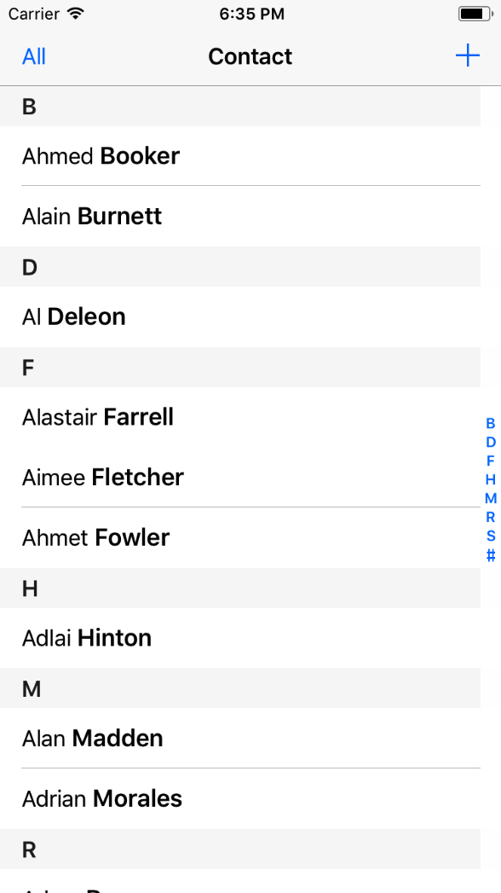
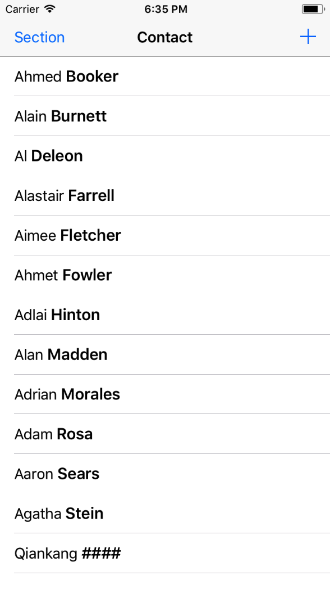
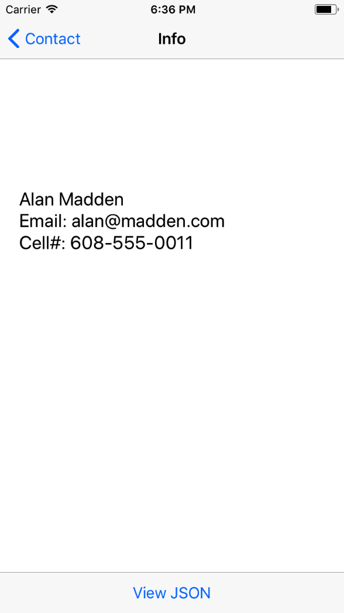
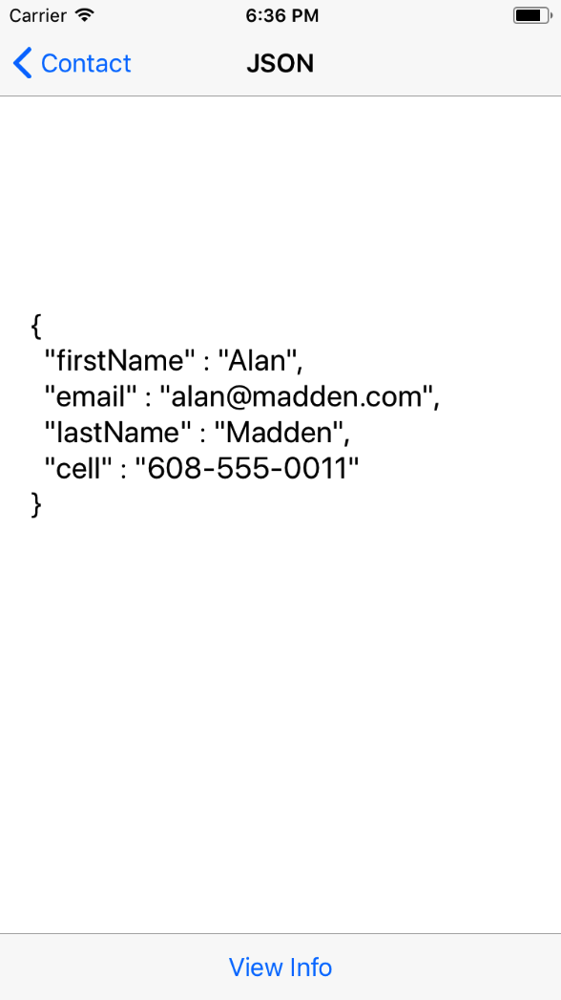
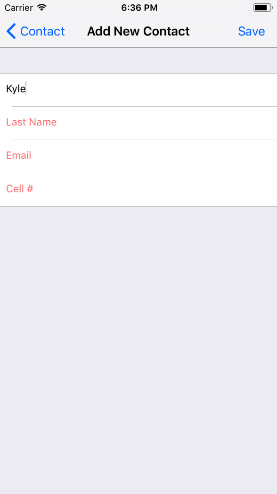

# Challenge3_Local_JSON_Kyle

## Two Layouts

#### Section Layout
1. With bold last name and an alphabet scroll bar on right
2. "All" is the toggle button for switching layouts

#### All Layout
1. Reomve the scroll bar
2. Toggle button title changed to "Section"

## Detail Info

#### Info
1. Shown when the corresponding row clicked in tableView
2. Click "View JSON" to switch to JSON

#### JSON
1. Toggle button title changed to "View Info"

## Add New Contact

1. "Save" only saves info when all fields not empty
2. Placeholder text turns red when a text field left empty when "Save" clicked

